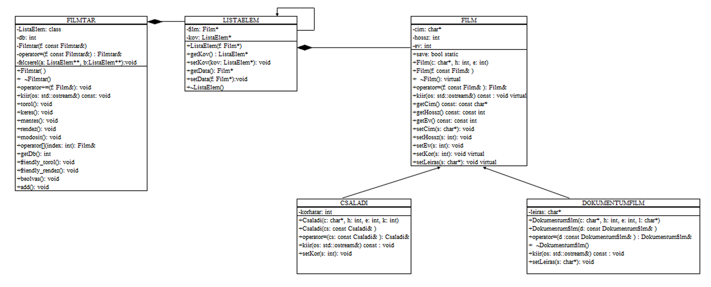

# This was the description of the task
 
Create a movie filing system. We store the title, playing time and 
year of publication. There is also an age limit for family films, and one for documentaries 
we also store a text description. Design an easily extensible object model for the task! 
Demonstrate the operation with a test program compiled as a separate module!  
Do not use an STL container for the solution!

# Class diagram

