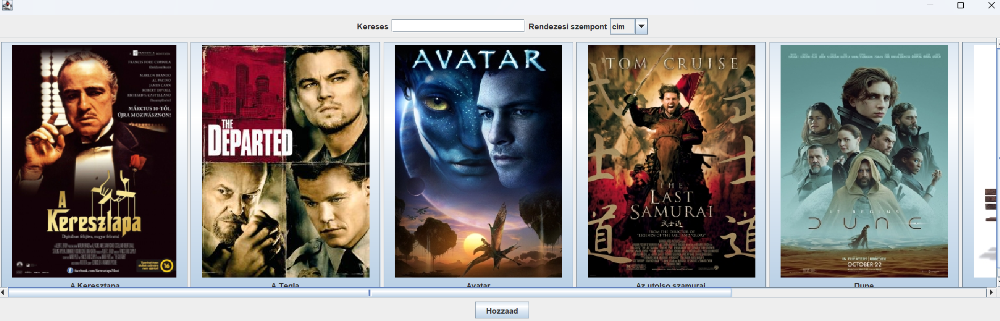

# About this project

MovieStore is a database management program, in Java, with a Swing graphical user interface 
with the following functions. The program stores the data of the movies (photos scanned from a file can also be stored 
for data). The title, original title, year of release, and playback date of the films are recorded 
time, genre, age limit, text description, director, age limit, etc. Menu usage Java Swing 
implemented with widgets.   
- Record a new movie. 
- List of film library content sorted by name, year, and genre. 
- Modify movie data and delete movie. 
- Saving the data. 
- Exit. 
I'll store the movie data in one of Java's built-in collection classes. 
Even after restarting the program, you will be able to reload the already recorded movies. 
I test the main function of the program with the JUnit testing framework.

