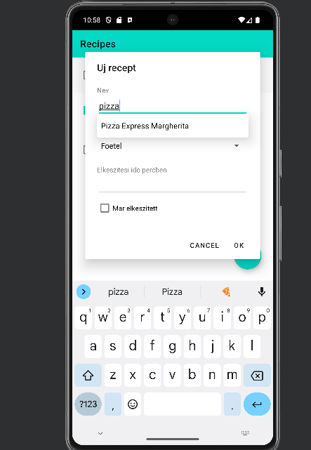
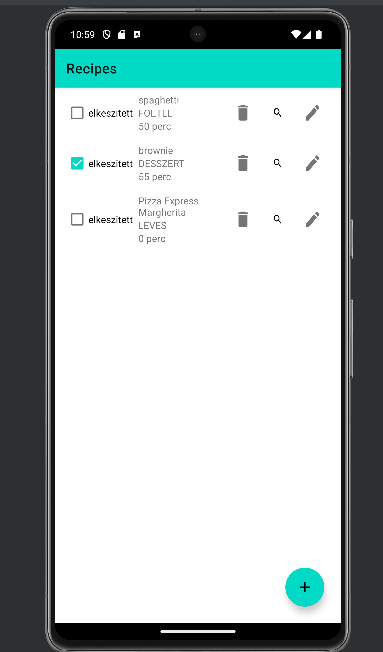

# About this project

I want to create a recipe management application. The target audience of my app is all people who like to cook. The purpose of this app is to make life in the kitchen easier for those who have this as a hobby or job. I think it would help inform the user much faster and better about a dish than using a recipe book to prepare food.

# Functions

I store the necessary ingredients from a recipe (e.g. 2 kg of flour, 1 tablespoon of cream, etc.) and the description of how to prepare it. The quantity, name, and price of the ingredients will be stored. Recipes and ingredients can be added, modified, or deleted with the application. When adding a new recipe, the Api used offers the names of possible recipes for a specified word fragment. With a checkbox, you can select already prepared meals and already purchased/existing ingredients. If a description of its preparation/important information is not provided for a recipe (e.g. if not a single ingredient is listed), an information message will pop up at the bottom.

# Used technologies

- UI
- fragments
- Persistent data storage
- RecyclerView
- Snack bar
- Intent
- Api

